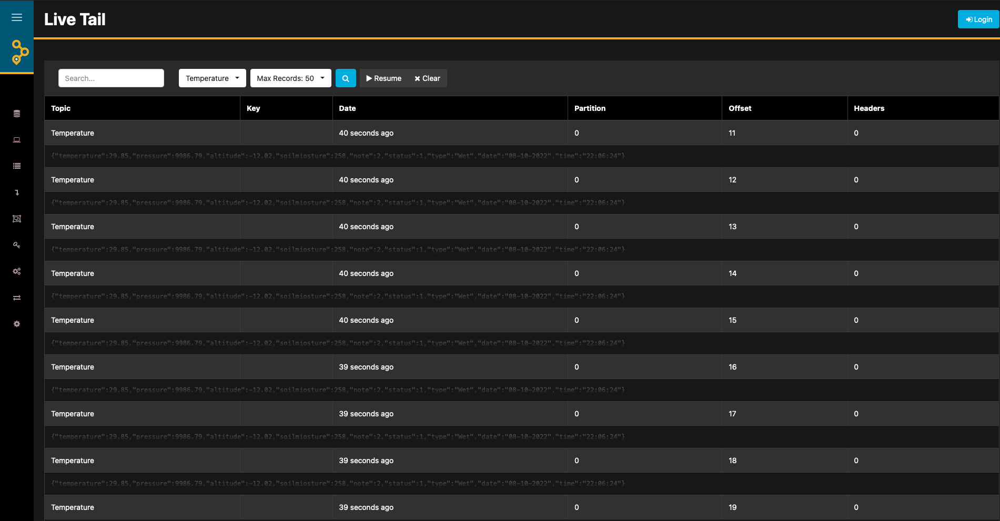
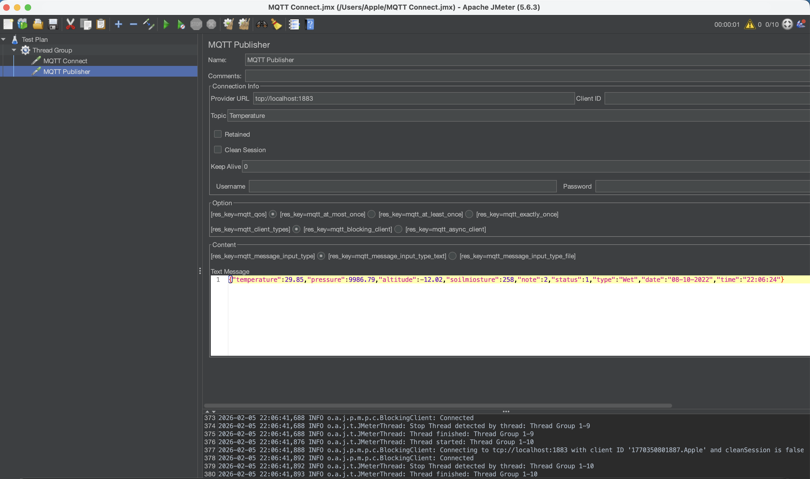

---

# Irrigation Planning System (MQTT -> Kafka -> Postgres)

An irrigation planning system that collects sensor data from farmlands, streams it through MQTT -> Kafka, and persists it into Postgres. The goal is to run time-series prediction for irrigation scheduling based on the trained models. This repo also includes a full local stack (Kafka, Zookeeper, Schema Registry, Connect, AKHQ UI, Mosquitto, Prometheus, Grafana) via Docker Compose. An ML notebook is included for training prediction models, with a planned step to embed inference into the live ingestion flow.

## What It Does
- Subscribes to an MQTT topic (websocket transport) and publishes each message to Kafka.
- Consumes the same Kafka topic and writes records into Postgres via JPA.
- Exposes observability for Kafka/ZK/Schema Registry/Connect via JMX exporter -> Prometheus -> Grafana.
- Uses a training notebook to build irrigation prediction models (see `IOT ML Code.ipynb`).

## Architecture (High Level)
- Mosquitto (MQTT broker) -> Spring Boot listener -> Kafka topic
- Kafka consumer -> Spring Boot -> Postgres
- JMX exporter -> Prometheus -> Grafana
- AKHQ provides a Kafka UI

Planned (ML in the loop):
- MQTT sensor payload -> model inference -> prediction stored alongside raw data

## Services (Docker Compose)
Ports exposed on the host:
- Mosquitto: `1883` (MQTT), `9001` (MQTT over websockets)
- Kafka brokers: `9092`, `9093`, `9094`
- Schema Registry: `8081`
- Kafka Connect: `8083`
- AKHQ: `8080`
- Prometheus: `9090`
- Grafana: `3000`
- Postgres: `5434` (container `5432`)

## Quick Start
1. Start the stack:
```bash
docker compose up -d
```

2. Run the Spring Boot app (choose one):
```bash
./mvnw spring-boot:run
```
```bash
docker compose up -d --build app
```

3. Publish a sample MQTT message:
```bash
docker compose exec mosquitto mosquitto_pub \
  -t Temperature \
  -m '{"temperature":"22.5","pressure":"1012","altitude":"120","soilmiosture":"33","note":"ok","status":1,"type":"demo","date":"2026-02-06","time":"10:15:00"}'
```

4. Verify in Postgres:
```bash
docker compose exec postgres psql -U root -d kafka -c "select * from sensor_data;"
```

## Run Spring Boot in Docker
The `app` service in `compose.yaml` builds the Spring Boot application using Maven and runs it inside a container.

```bash
docker compose up -d --build app
```

To rebuild after code changes:
```bash
docker compose up -d --build app
```

## Screenshots
AKHQ live trail log:


JMeter MQTT testing:


## Message Format
The consumer expects JSON with these fields:
- `temperature` (string)
- `pressure` (string)
- `altitude` (string)
- `soilmiosture` (string)  
  Note: the code currently reads `soilmiosture` (typo) rather than `soilmositure`.
- `note` (string)
- `status` (int)
- `type` (string)
- `date` (string)
- `time` (string)

## ML Notebook
The notebook `IOT ML Code.ipynb` contains the ML workflow used for irrigation planning and time-series driven prediction:
- Data loading, wrangling, and EDA
- Feature encoding and correlation analysis
- Model training and evaluation
  - Logistic Regression
  - Gaussian Naive Bayes
  - Support Vector Classifier
  - GridSearchCV for hyperparameter tuning

Note: The notebook reads `Irrigation Scheduling.csv`.

## Configuration
Key settings in `src/main/resources/application.properties`:
- `spring.kafka.bootstrap-servers=127.0.0.1:9092,127.0.0.1:9093,127.0.0.1:9094`
- `mqtt.topic=Temperature`
- `mqtt.broker.url=ws://localhost:9001`
- `spring.datasource.url=jdbc:postgresql://127.0.0.1:5434/mqtt`

Mosquitto config is in `mosquitto/mosquitto.conf` and exposes both MQTT and websocket listeners.

## AKHQ Login
AKHQ is enabled with basic auth:
- Username: `myuser`
- Password: `admin123`

## Notes
- The default Postgres database name is `kafka`. If you want `mqtt`, update `POSTGRES_DB` in `compose.yaml` and `spring.datasource.url`.
- `spring.jpa.hibernate.ddl-auto = create` recreates tables on startup.

## Repo Structure
- `compose.yaml`: Local stack definition
- `src/`: Spring Boot app (MQTT -> Kafka -> Postgres)
- `mosquitto/`: MQTT broker config
- `prometheus/`: Prometheus config
- `grafana/`: Grafana provisioning
- `jmx-exporter/`: JMX exporter config for Kafka/ZK/Schema Registry/Connect
- `schemas/`: Example schema assets
